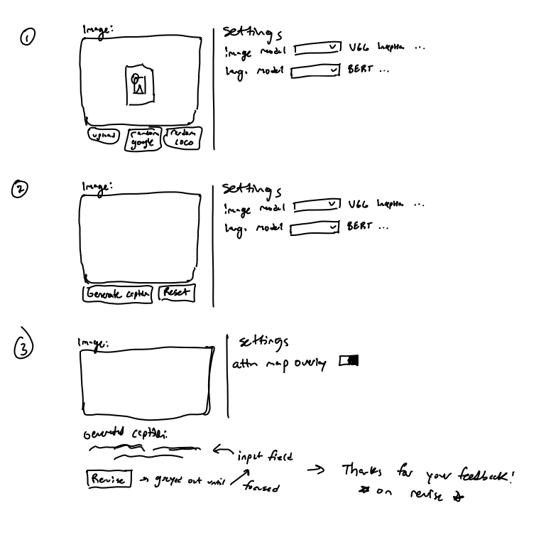

# Milestone 2 - Progress report, proof of concept, and updated project outline
Group: AutoCap

Project: Caption this image

## Team members
- Brendan O'Leary
- Luke Sagers
- Kamran Ahmed

> Our problem definition and proposed solution remain the same. We will create a web application to automatically generate image captions using a combination of computer vision and natural language processing models.

Notebooks for the associated analysis and modeling are included in the `notebooks` folder under `milestone2_AutoCap`.

## Exploratory Data Analysis
For our baseline models we downloaded the MS-COCO dataset which contains ~330k images with at least 5 captions per image. Our training data was composed of 118,287 RGB images and 591,753 captions. There are 53,953 unique words in all of the captions.

Here are four random sample images from the training data and five captions associated with them (note that we inserted "\<start\>" and "\<end\>" tokens):

Although some of the captions are technically incorrect, they are very similar to each other.

## Data Pipelines
To speed up our baseline modeling we chose a random subset of images and their corresponding captions. In one modeling scenario we chose a subset of 5,000 images with 25,011 captions (Model #1), in another we chose 10,000 images and their 50,031 captions (Model #2). This was just to test our basic data pipelines and models. We intend to train our final models on the entire training dataset.

The captions are tokenized using the TensorFlow `Tokenizer`, filtering out punctuation, and added an out of vocabulary token. The data is then split into 80% training and 20% testing data. We then create a flexible and efficient data pipeline using TensorFlow Data. The image is read from the image path, decoded, and resized and preprocessed according to the vision model we use downstream.

## Baseline Modeling
Our team explored two caption models simultaneously, both of which were inspired by architectures from seminal papers on image caption generation: [Show and Tell: A Neural Image Caption Generator](https://arxiv.org/pdf/1411.4555.pdf) and [Show, Attend and Tell: Neural Image Caption Generation with Visual Attention](https://arxiv.org/pdf/1502.03044.pdf). We do not use attention here to get a proper and fair baseline for future model comparison. We used a convolutional neural network, InceptionV3, pretrained on the ImageNet dataset to extract high-level features from the images. These features are then passed through an RNN to predict the next word for captioning. We used the research paper, [Where to put the Image in an Image Caption Generator](https://arxiv.org/pdf/1703.09137.pdf) to decide that the extracted image features will be injected into the same RNN that processes the words as described above rather than merging the image with the output of the RNN after processing the words.

The two models differ depending on where the image features are being injected into the RNN. In Model #1, the image features are used as the input for the first step of the RNN. In Model #2, the image features are combined with the word vectors at each time step into a single input before being passed to the RNN. The latter model would allow us to incorporate an attention-based mechanism in the future. Nevertheless, the two models essentially have the same basic architecture. Each model was trained for 10 epochs locally or in Google Colab.

### Model 1 results
**Loss curve**

**Evaluation example**

Real Caption: \<start\> a bathroom with two different styles of toilets \<end\>

Predicted Caption: a bathroom with marble tile floor and a shower curtain \<end\>

### Model 2 results
**Loss curve**

**Evaluation example**

Real Caption: \<start\> a white sink that has a necklace a rubber \<unk\> toothpaste and some beauty items laying around them \<end\>

Predicted Caption: a bathroom with a sink and a sink \<end\>

### Findings
From the loss plots, both models improve slightly during training and we may want to incorporate a measure of accuracy and an evaluation loop on validation data. Based on the results of the predicted captions, these models are mediocre and could be significantly improved.

## Future directions
There is no current update to our proposed timeline and components from Milestone 1. We are on track and the work shown here has been a starting point for model exploration and selection.
We have set up a GCP Bucket where we will be able to store the models along with any data that we choose to collect from the application once it is deployed. An example of data we might collect could be an image uploaded by a user with a caption that is approved or corrected by the user.

### Modeling
- Since there are at least 5 captions per image, we do not need to pass the image through our CNN feature extractor each time. We will cache these features to disk.
- We will also include validation data to better assess model performance and accuracy.
- We will expand on the models chosen here to primarily increase captioning accuracy. Our first step will be to use pre-trained GLoVe embeddings to decrease training time and improve performance. Next, we will incorporate an attention mechanism to significantly improve our accuracy. This will also allow us to generate attention maps with respect to each word in the predicted caption to show the user in the web app. Further, we will give the web app user multiple image and language models to choose from (e.g. image: MobileNet, InceptionV3, VGG16; language: RNN, RNN with attention, etc.). We believe that this will be a unique way to incorporate a speed versus accuracy tradeoff. 
- Creating a large number of models will require us to incorporate Weights and Biases to track our models and their hyperparameters.
- All of these future modeling directions will require us to create a standardized data and modeling pipeline. We are currently exploring various options to work together and create and store models simultaneously.

### Application
We created a rough mockup of our web application where users have the option to upload an image or select a random image from Google or the MS-COCO dataset. As aforementioned, we will also include model settings where the user can select their preferred image and language models. After the caption is generated, the user has the option to revise and update the caption which will allow us to further train our model(s). 

We created a rudimentary and non-functioning single-page application using a React frontend and a Flask server, both of which reside in different Docker containers, but are simultaneously orchestrated by Docker. Once our data and modeling pipeline is created we will build the backend infrastructure in order to caption the uploaded images.

First view with image upload and settings component:

Second view after image upload:
