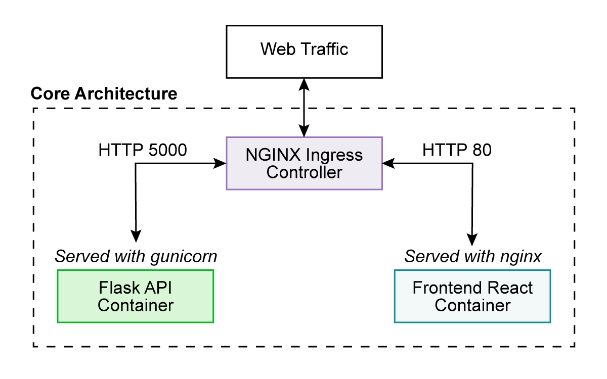

# AutoCap - Image Captioning

*This article was produced as part of the final project for Harvard’s AC215 Fall 2021 course.*

Project: “Caption this image”

Authors: Brendan O'Leary, Luke Sagers, James Parker, and Kamran Ahmed

Link to GitHub repository: https://github.com/kamodulin/AC215_AutoCap

## Introduction & Problem Statement
The World Health Organization (WHO) estimates that 314 million people suffer from visual impairment. Approximately 269 million of these suffer from low vision and the remaining 45 million are blind (Resnikoff 2008). The visually impaired rely on screen readers to access the internet through audio, and thus depend on image captions (Yesilada 2004). Additionally, photo album indexing, automatic social media captioning, and image filtering are just some of the many applications that make accurate automatic image captioning an important priority. 

Ultimately, obtaining accurate image captions from a model will benefit both specialized and generalized fields. In a specialized field, like healthcare, image captioning could bring down the high cost of data annotation (Willemink 2020) and aid in improving the interpretation of medical images (while potentially giving more interpretability than a simple classification model). On the general side, automatic captioning can be used to create large labeled datasets from any image source and can also lead to improvements for models such as semi-supervised learning models.

Image captioning is an interesting use case where computer vision and natural language processing interact with each other. Over the last decade, advancements in computer vision, natural language processing, and computing have led to complicated and sophisticated models. These models are large and require a lot of data and training. However, once trained, these models can be leveraged for other tasks, a concept known as transfer learning. Image captioning is a task that can use these pre-trained image and NLP models. These sophisticated models, in addition to abundant training data and computing power, result in highly accurate image captioning models for the benefit of the visually impaired.

## Proposed Solution
The objective of our image caption model is to take an image as an input and produce a sequence of text that serves as the caption of the image. We can achieve this with a deep learning encoder-decoder model, where the image is encoded into features that are then decoded into a sequence of text. The encoder is a CNN feature extractor model and the decoder is a sequential language model. There are several possible models to use as the image feature extractor and language model. We plan to consider all of these models and explore their ability to successfully caption images.

## Data

### Data for Model Training and EDA
We trained our image captioning model using the large, publicly available dataset MS-COCO (Microsoft Common Objects in Context) (Lin 2014). The dataset, which was published by Microsoft, includes 330,000+ images along with labels, captions, and segmentation maps for a large proportion of the images. Our training data ultimately consisted of 118,287 RGB images with five captions for each image. Samples of images with their associated captions are shown below. The majority of image captions contained between 8 and 12 words, with the distribution being skewed right by a few longer captions. Overall, we felt like this dataset was a great fit for our learning task due to its wide range of subjects and rich captions.

  
  
Sample Images and Corresponding Captions in the MS-COCO Training Set

  
  
Caption Length Distribution in the MS-COCO Training Set

  
  
Top-25 Word Frequencies in the MS-COCO Training Set

### Data Preprocessing
Images were resized to match the input shape of whichever vision model was being used for training and normalized so that pixels contained values that were also consistent with the selected vision model.

The captions were tokenized using the TensorFlow Tokenizer and, after eliminating punctuation, the vocabulary size was limited to 5,000. Included in this vocabulary were `<start>` and `<end>` tokens that we added to each caption and an `<unk>` token that represents a word outside of the vocabulary. We created word-to-index and index-to-word mappings and then padded each caption sequence to the length of the longest caption. 

With our pre-processing steps defined, we were able to split the dataset 80/20 into training and testing sets. We then created a flexible and efficient data pipeline using TensorFlow Data. With this pipeline the image could be read from the image path, decoded, resized, and preprocessed according to the vision model we use downstream. 

## Modeling

### Baseline
To build baseline models for our captioning task, we explored two caption models simultaneously, both of which were inspired by architectures from seminal papers on image caption generation: Show and Tell: A Neural Image Caption Generator (Vinyals 2015) and Show, Attend and Tell: Neural Image Caption Generation with Visual Attention (Xu 2015). We did not use attention during these first attempts in order to get a proper and fair baseline for future model comparison. We used a convolutional neural network, InceptionV3, pretrained on the ImageNet dataset to extract high-level features from the images. These features are then passed through an RNN to predict the next word for captioning. We used the research paper, Where to put the Image in an Image Caption Generator (Tanti 2018) to decide that the extracted image features will be injected into the same RNN that processes the words as described above rather than merging the image with the output of the RNN after processing the words.

Our two models differ depending on where the image features are being injected into the RNN. In Model #1 (init-inject), the image features are used as the input for the first step of the RNN. In Model #2 (par-inject), the image features are combined with the word vectors at each time step into a single input before being passed to the RNN. The latter model would allow us to incorporate an attention-based mechanism in the future. Nevertheless, the two models essentially have the same basic architecture. Each model was trained for 10 epochs locally or in Google Colab.

  
  
Comparison of baseline models’ architecture and performance. Architecture schematics adapted from Where to put the Image in an Image Caption Generator (Tanti 2018).

Due to limited time and computational resources, we only plot training loss. In the future we should include validation data to better assess model performance. Further, we should assess accuracy on our test set.

### Multiple model combinations
We had the idea of allowing users of our application to select which vision and language model they wanted to employ when creating image captions. In order to make this a reality, we had to train the combinations of each vision and language model separately, since different models and architectures call for different sizes and specifications for their input parameters. We ended up training combinations of the following three vision models: InceptionV3, VGG16, and EfficientNetB0 and the following two language models: RNN with Attention and Transformer. Together, that meant training six models, either locally or with Google Colab.

  
  
Outputs from vision models (top) are fed into language models (bottom), with arrows representing the six unique combinations of models trained in our project.

We go into further detail about the language models in the following sections.

### RNN with Attention
After training our baseline models on recurrent neural networks without attention, we took inspiration from Xu et al.’s 2015 paper Show, Attend and Tell: Neural Image Caption Generation with Visual Attention and included a Bahdanau Attention layer (Bahdanau 2014) in our RNN for caption generation. Just like in our baseline models, an image is passed through one of the vision models listed above and the outputs from the last convolutional layer are passed through a single fully connected layer. The decoder uses a RNN with gated recurrent units (GRU) to attend over the image features and predict the next word in the caption. The RNN’s output is combined with a weighted sum over the extracted features at each time step to predict the next word. This attention-based model allows us to visualize the features that are most prominent in the prediction of different words in the caption. This model is diagrammed below.

  
  
Figure from Show, Attend and Tell: Neural Image Caption Generation with Visual Attention (Xu 2015) which outlines the RNN-Attention mechanism using high-level features extracted from a CNN.

### Transformer
In addition to the RNN with attention model, we investigated an alternative model architecture that relies solely on attention to handle the sequential aspect of image captioning. In their novel paper, Vaswani, et al (2017) introduced the transformer model, which does not use recurrence or convolutional neural networks to model sequential data. While originally used in natural language processing, transformers have also been used for time series data and images. 

We modify the architecture of a transformer for the task of image captioning. The main difference between a traditional NLP transformer and our transformer is that our transformer receives image features as an input to the encoder. Similar to a traditional NLP transformer, our decoder receives sequential text as an input and predicts the probability of the next word. The modified transformer architecture can be seen below:

  
  
Adapted from Attention Is All You Need (Vaswani 2017)

As with our other models, we use a pre-trained CNN model to get high-level features of each image. For example, the InceptionV3 model has a feature shape of 8 x 8 x 2048 after its last convolutional layer. Our model transforms this feature data to a shape of 64 x 512. Here the input can be thought of as a sequence of length 64 with each component of the sequence having an embedding dimension of 512. Unlike one-dimensional text, images are two-dimensional so we use two-dimensional positional encoding for the encoder.

The encoder and decoder of our transformer are each made up of a stack of two layers. As in a traditional transformer, each layer contains a multihead self-attention layer and a feedforward layer. The decoder has an additional multihead attention layer to attend to the output of the encoder. Each multihead attention layer has 4 heads. 

Our transformer was based off of: https://www.analyticsvidhya.com/blog/2021/01/implementation-of-attention-mechanism-for-caption-generation-on-transformers-using-tensorflow/

## Web Application
We developed a single-page application using React to easily create flexible and stateful components. The main components of this application include an image uploader, an attention overlay, and a caption. Briefly, a user can select their preferred vision and language models and submit an image for captioning. After a caption is generated, a user can hover over individual words to see which parts of the image the language model was focusing on as it generated the caption.

We created a Flask API to serve our models. This API exposes two endpoints, `/models` and `/predict`. A `GET` request to `/models` returns a JSON object which includes all of the vision and language models that are available for inference. A `POST` request that includes image data and the selected vision and language models to `/predict` will return an image caption and an attention array.

  
  
AutoCap application views and flow

## Deployment
Deployment to GCP was automated using [Ansible Playbooks](https://docs.ansible.com/ansible/latest/user_guide/playbooks.html). Ansible is a tool that supports that development of Infrastructure as Code (IaC), a development method of provisioning and managing code through human readable and machine consumable configuration files, making them extremely amenable to the same type of version control systems (VCS) that manage application code.

Frontend React and Flask API containers are first built and pushed to the Google Container Registry. As part of this process, the React frontend is built for production and the static files are set up to be served with NGINX. Additionally, the Flask API is prepared to be served with `gunicorn` for production. We used Kubernetes in Google Cloud Platform to orchestrate and manage both of our Docker containers. We also created an NGINX Ingress Controller to properly route web traffic to our Frontend and API services.Our deployed app can be found at http://35.192.169.60.sslip.io.

  
  
Deployment architecture

## Browser Extension
We created a Chrome browser extension to automatically add alternative text to images so that people who heavily rely on screen readers, such as those with visual impairments, can better understand the content of images on websites they visit. The extension iterates through all images without an `alt` attribute on a webpage and uploads these images to our Flask API. Returned captions are automatically added to the corresponding `img` tag. We also plan to create a similar Safari extension in the future. [Chrome extension demonstration video](https://youtu.be/u89L2u9Lzfc).

## Conclusion and Future Directions
This application provided numerous opportunities to develop our skills at each layer of the DLOps stack — data, models, development, and operations. We created complex image captioning models using a variety of modern techniques and were able to create a web application and browser extension to showcase the power and utility of these models to a wider audience.

During this process we’ve also considered a lot of additional improvements we’d like to make. Some of these ideas are captured below:
- Leverage pre-trained GLoVe embeddings to decrease model training time and improve performance
- Bolster the currents selection of language models and improve the user’s ability to experiment
- Create a user feedback mechanism to capture caption corrections and develop an automated method to retrain based on this input
- Create a similar browser extension for Safari
- Improve server-side security and explore system manipulation defenses (especially if using reinforcement or perpetual learning techniques as suggested above)
- Develop image tagging for offensive content

Additional image captioning architectures exist which provide improved results upon traditional CNN + Transformer methods. These models use advanced techniques such as geometric attention, sequence-to-sequence prediction, bipartite matching, etc. Incorporation of these architectures alternative models into the application is an area for future enhancement. Some of these papers are listed below for reference:

### Related Research Publications:
Simao Herdade, Armin Kappeler, Kofi Boakye, Joao Soares: “Image Captioning: Transforming Objects into Words”, 2019; [http://arxiv.org/abs/1906.05963 arXiv:1906.05963]

Wei Liu, Sihan Chen, Longteng Guo, Xinxin Zhu, Jing Liu: “CPTR: Full Transformer Network for Image Captioning”, 2021; [http://arxiv.org/abs/2101.10804 arXiv:2101.10804]

Nicolas Carion, Francisco Massa, Gabriel Synnaeve, Nicolas Usunier, Alexander Kirillov, Sergey Zagoruyko: “End-to-End Object Detection with Transformers”, 2020; [http://arxiv.org/abs/2005.12872 arXiv:2005.12872]

Lun Huang, Wenmin Wang, Jie Chen, Xiao-Yong Wei: “Attention on Attention for Image Captioning”, 2019; [http://arxiv.org/abs/1908.06954 arXiv:1908.06954]

Marcella Cornia, Matteo Stefanini, Lorenzo Baraldi, Rita Cucchiara: “Meshed-Memory Transformer for Image Captioning”, 2019; [http://arxiv.org/abs/1912.08226 arXiv:1912.08226]

## References
Bahdanau, Dzmitry, Kyunghyun Cho, and Yoshua Bengio. "Neural machine translation by jointly learning to align and translate." arXiv preprint arXiv:1409.0473 (2014).

Lin, Tsung-Yi, et al. "Microsoft coco: Common objects in context." European conference on computer vision. Springer, Cham, 2014.

Resnikoff, Serge, et al. "Global magnitude of visual impairment caused by uncorrected refractive errors in 2004." Bulletin of the World Health Organization 86 (2008): 63-70.

Tanti, Marc, Albert Gatt, and Kenneth P. Camilleri. "Where to put the image in an image caption generator." Natural Language Engineering 24.3 (2018): 467-489.

Vaswani, Ashish, et al. "Attention is all you need." Advances in neural information processing systems. 2017.

Vinyals, Oriol, et al. "Show and tell: A neural image caption generator." Proceedings of the IEEE conference on computer vision and pattern recognition. 2015.

Willemink, Martin J., et al. "Preparing medical imaging data for machine learning." Radiology 295.1 (2020): 4-15.

Xu, Kelvin, et al. "Show, attend and tell: Neural image caption generation with visual attention." International conference on machine learning. PMLR, 2015.

Yesilada, Yeliz, et al. "Screen readers cannot see." International Conference on Web Engineering. Springer, Berlin, Heidelberg, 2004.